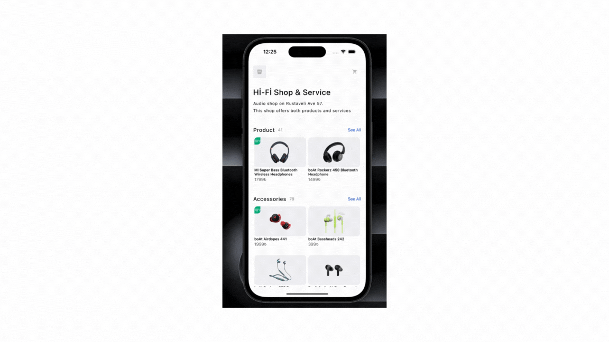

# E-Commarge Sepet İşlemleri

BU proje, React Native kullanarak bir e-ticaret sepet işlemleri uygulaması geliştirmektedir. Kullanılan temel teknolojiler ve kütüphaneler aşağıda detaylandırılmıştır.

1-React Native
- Temel framework, mobil uygulama geliştirme.

2-react-native-screens
- Native ekranlar ve gezinme işlemlerinin optimizasyonu için kullanılır.

3-react-native-safe-area-context
- Güvenli alanlar içerisinde UI bileşenlerini düzgün yerleştirmek için kullanılır.

4-@react-navigation/native-stack
- Uygulama içinde sayfalar arası gezinme işlemleri için kullanılır.

5-react-native-gesture-handler
- Kullanıcı etkileşimleri ve jest işlemleri için kullanılır

6-react-native-vector-icons
- İkonları uygulamada kullanmak için popüler bir kütüphane.

7-react-native-toast-message
- Uygulamada toast mesajları göstermek için kullanılır

8-react-native-uuid
- UUID oluşturmak için kullanılır, benzersiz tanımlayıcılar üretir

9-@react-native-async-storage/async-storage
- Yerel depolama işlemleri için kullanılır, kullanıcı verilerini cihazda saklamak için idealdir.

# E-Commarge-Sepet-lemleri
